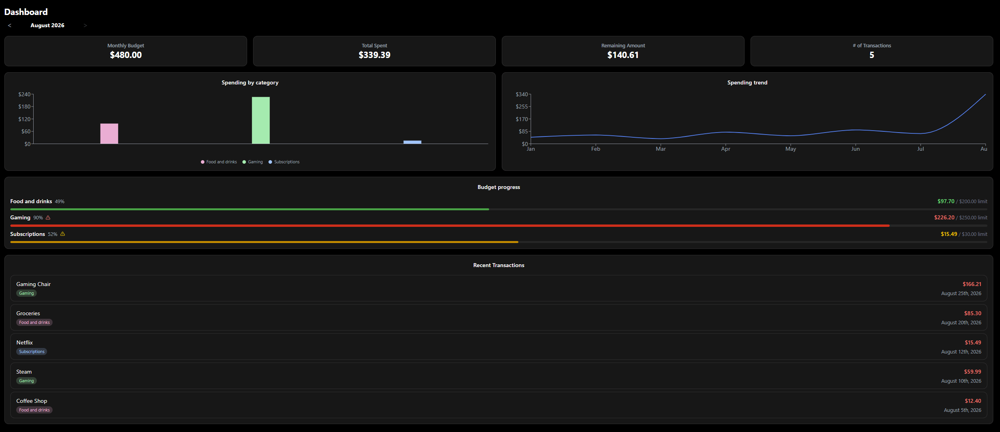
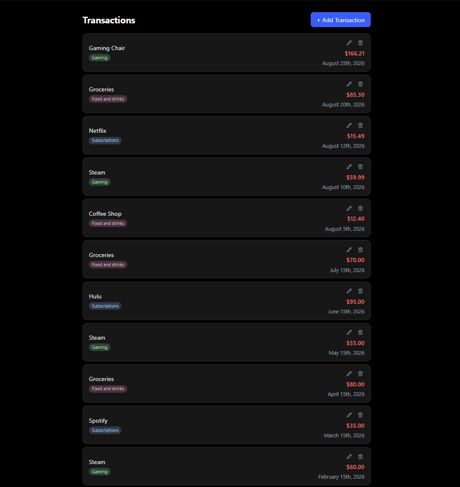
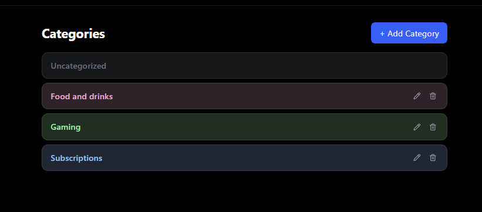
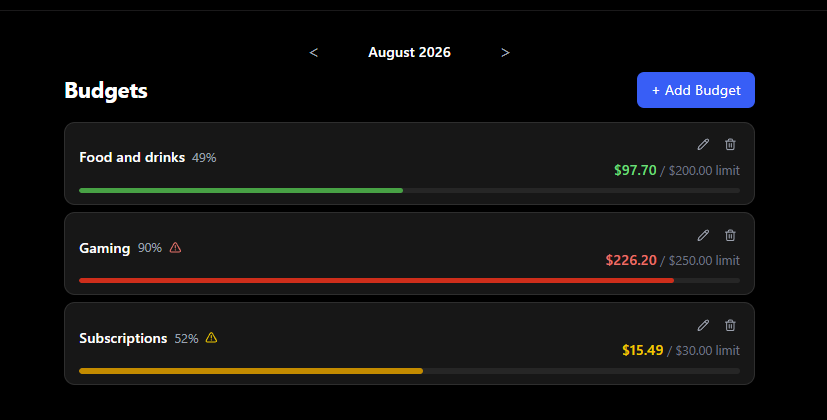

# Budget Tracker - Frontend

A React + TypeScript single-page app for tracking personal spending, setting monthly budgets by category, and catching overspending before it happens. Talks to the [Django REST API backend](https://github.com/parekhr/budget-tracker-backend) - no mock data, every number on screen comes from the real database.

**Live demo:** [budget-tracker-frontend-kohl.vercel.app](https://budget-tracker-frontend-kohl.vercel.app)

## Screenshots







## Tech Stack

- React 19 + TypeScript
- Vite
- Tailwind CSS v4
- React Router
- Recharts (dashboard charts)
- lucide-react (icons)

## Features

- **Auth**: login, registration, forgot/reset password (real email), authenticated change-password and change-username, with automatic silent token refresh - a session survives a page reload and an expired access token without ever bouncing the user to `/login`
- **Dashboard**: monthly summary cards, a spend-by-category chart, a multi-month spending trend line, budget progress bars, and recent transactions
- **Transactions**: create, edit, and delete, each tagged with a category
- **Categories**: create, edit, and delete, each with a name and color; every account has a protected "Uncategorized" fallback category that can't be edited or removed - deleting any other category automatically moves its transactions there
- **Budgets**: a monthly spending limit per category, with a live spent/remaining bar and an over-limit warning
- Fully responsive, including a dedicated mobile navigation menu
- Dark theme throughout

## Setup

### Prerequisites

- Node.js 18+
- The [backend](https://github.com/parekhr/budget-tracker-backend) running - this app has no built-in mock mode, it expects a real API

### 1. Install dependencies

```bash
npm install
```

### 2. Environment variables

Create a `.env` file in the project root:

```
VITE_API_URL=http://localhost:8000/api
```

### 3. Run the dev server

```bash
npm run dev
```

The app is available at `http://localhost:5173`.

## Available Scripts

| Command | Description |
|---|---|
| `npm run dev` | Start the Vite dev server |
| `npm run build` | Type-check and build for production |
| `npm run preview` | Preview a production build locally |
| `npm run lint` | Run oxlint |

## Related

- [Backend](https://github.com/parekhr/budget-tracker-backend) - the Django REST API this app talks to
